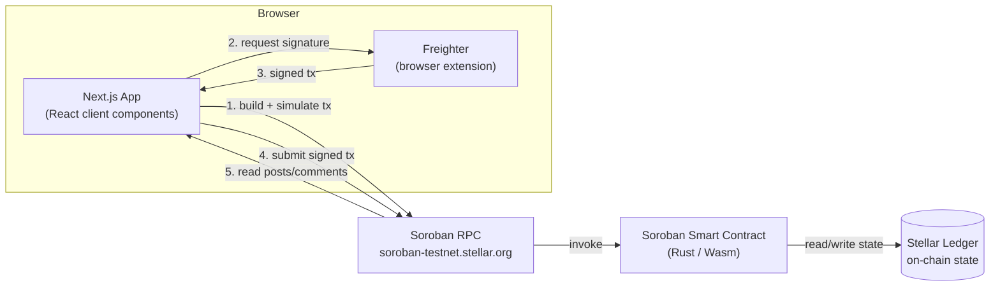

<div align="center">


# BlogChain

**A decentralized blog with no backend, no database, and no admin key —
every post and comment is a signed Soroban transaction.**

[](https://soroban.stellar.org)
[](https://stellar.org)
[](https://nextjs.org)
[](./LICENSE)

[Live Contract](#-contract-address--explorer) · [Features](#-features) · [Architecture](#-architecture) · [Getting Started](#-getting-started) · [Roadmap](#-roadmap--future-improvements)

</div>

---

## 📌 Overview

BlogChain is a decentralized application (dApp) that puts publishing
directly on-chain. Posts and comments are stored as Soroban smart contract
state on the **Stellar** network — there's no central server, no
content-moderation layer, and no privileged admin key. Once deployed, the
contract governs itself; the Next.js frontend is just a client for it.

Every write (publishing a post, adding a comment) is a transaction the
**Freighter** wallet extension simulates and signs in the browser before
it's submitted to Soroban. There is no backend API and no database — the
entire application state lives on the Stellar ledger.

## 🚀 Features

### Currently implemented

- **Permissionless publishing** — any Stellar address can publish a post
  directly to the contract; no allowlist, no approval step, no admin gate.
- **On-chain storage** — post title, content, author, timestamp, and
  comment count live in Soroban contract state, not a database.
- **Comments** — anyone can comment on any post, signed by their own
  Freighter wallet and stored on-chain against that post.
- **Freighter wallet integration** — connect, request access, and sign
  every write transaction from the browser; the app never touches a
  private key.
- **Simulate-before-submit** — every write is simulated via the Soroban RPC
  before the wallet is asked to sign, so failures surface before a
  transaction is broadcast.
- **Feed / Write / View tabs** — browse all published posts, publish a new
  one, or open a single post to read its full content and comment thread.
- **Error monitoring & analytics, opt-in** — Sentry and PostHog are wired
  in and simply no-op if you don't configure them (see `client/.env.example`).

### Not yet implemented

A few ideas that are natural next steps for this architecture — likes,
tipping, tags, and a trending sort — are **not** in the current contract or
UI. They're tracked honestly in [Roadmap](#-roadmap--future-improvements)
rather than claimed here.

## 🖼️ Screenshots

<div align="center">

**Deployed contract on Stellar Expert**


**BlogChain UI**


</div>

## 🏗️ Architecture

There is no backend. The browser talks to the wallet extension and to the
public Soroban RPC directly; the smart contract is the only source of
truth.



**Read path:** the UI calls the contract's read-only functions
(`get_all_posts`, `get_post`, `get_comments`) through the RPC's simulation
endpoint — no signature or fee required.

**Write path:** the UI builds a transaction invoking `create_post` or
`add_comment`, simulates it, sends it to Freighter for a signature, then
submits the signed XDR back to the RPC for inclusion in the ledger.

## 📁 Folder Structure

```
decentralized-blog-main/
├── client/                          # Next.js frontend (the dApp)
│   ├── app/                         # App Router: pages, layout, error boundaries
│   │   ├── page.tsx                 # Home page — wallet connect + ContractUI
│   │   ├── layout.tsx                # Root layout, fonts, AnalyticsProvider
│   │   ├── error.tsx / global-error.tsx
│   │   └── globals.css
│   ├── components/
│   │   ├── Contract.tsx             # Feed / Write / View tabs — the core app UI
│   │   ├── Navbar.tsx                # Wallet connection button, network badge
│   │   ├── AnalyticsProvider.tsx     # Initializes PostHog client-side
│   │   └── ui/                       # Small presentational primitives
│   ├── hooks/
│   │   └── contract.ts              # All Stellar SDK + Freighter + contract-call logic
│   ├── lib/
│   │   ├── analytics.ts             # PostHog event helpers
│   │   ├── errorMessages.ts         # Maps raw errors to user-friendly messages
│   │   └── utils.ts                 # cn() class-name helper
│   ├── instrumentation.ts / instrumentation-client.ts   # Sentry setup
│   ├── sentry.*.config.ts
│   └── package.json
│
├── contract/                        # Soroban smart contract workspace
│   ├── Cargo.toml                   # Workspace root, soroban-sdk version, release profile
│   ├── rust-toolchain.toml          # Pins a compatible Rust toolchain (wasm32v1-none)
│   └── contracts/contract/
│       ├── src/
│       │   ├── lib.rs               # The contract: create_post, get_post, add_comment, get_comments, get_all_posts
│       │   └── test.rs              # Unit tests using soroban-sdk testutils
│       ├── Cargo.toml
│       └── Makefile                  # make build / make test
│
├── DEPENDENCIES.md                  # Every dependency, what it's for, and why
├── REQUIREMENTS.md                  # Exact tool/version requirements
├── INSTALL.md                       # Step-by-step install/run/deploy/troubleshooting
└── README.md                        # You are here
```

## 📜 Smart Contract Overview

The contract (`contract/contracts/contract/src/lib.rs`) is intentionally
small and has **no owner, no pause switch, and no upgrade proxy** — once
deployed, its logic is immutable and every function is callable by any
address.

| Function | Description |
|---|---|
| `create_post(author, title, content) -> u64` | Stores a new post, auto-increments the post ID, returns it. |
| `get_post(post_id) -> Post` | Reads a single post by ID. |
| `add_comment(post_id, author, content) -> u64` | Appends a comment to a post and increments that post's `comment_count`. |
| `get_comments(post_id) -> Vec<Comment>` | Reads all comments for a post. |
| `get_all_posts() -> Vec<Post>` | Reads every published post. |

**Storage layout** (all in Soroban *instance* storage):

- `DataKey::PostCounter` → `u64`, the last-issued post ID
- `DataKey::Posts` → `Map<u64, Post>`, every post keyed by ID
- `DataKey::Comments(post_id)` → `Vec<Comment>`, per-post comment list

**`Post`**: `id`, `title`, `content`, `author`, `comment_count`, `timestamp`
**`Comment`**: `id`, `content`, `author`, `timestamp`

Build with the Stellar CLI (not plain `cargo build` — see `INSTALL.md` for
why): `stellar contract build`. The release profile in `contract/Cargo.toml`
(`opt-level = "z"`, `lto = true`, `strip = "symbols"`) keeps the compiled
Wasm under Soroban's 64KB contract size limit.

## 🧰 Tech Stack

| Layer | Technology |
|---|---|
| Frontend framework | [Next.js 16](https://nextjs.org) (App Router) + [React 19](https://react.dev) |
| Language | TypeScript, Rust |
| Styling | [Tailwind CSS v4](https://tailwindcss.com) |
| Blockchain SDK | [`@stellar/stellar-sdk`](https://www.npmjs.com/package/@stellar/stellar-sdk) |
| Wallet | [Freighter](https://www.freighter.app) via `@stellar/freighter-api` |
| Smart contracts | [Soroban](https://soroban.stellar.org) / [`soroban-sdk`](https://crates.io/crates/soroban-sdk) (Rust, compiled to Wasm) |
| Network | Stellar Testnet, via `soroban-testnet.stellar.org` |
| Observability | [Sentry](https://sentry.io) (errors), [PostHog](https://posthog.com) (analytics) — both optional |

Full dependency list with purposes: [`DEPENDENCIES.md`](./DEPENDENCIES.md).

## 🛠️ Getting Started

### Requirements

Node.js ≥ 20.9, npm, the [Freighter](https://www.freighter.app) browser
extension, and — only if you're touching the contract — Rust ≥ 1.84 with
the `wasm32v1-none` target and the [Stellar CLI](https://developers.stellar.org/docs/tools/cli/install-cli).
Full details: [`REQUIREMENTS.md`](./REQUIREMENTS.md).

### Installation

```bash
git clone <this-repo-url>
cd decentralized-blog-main/client
npm install
```

### Running locally

```bash
npm run dev
```

Open [http://localhost:3000](http://localhost:3000), install Freighter if
you haven't, switch its network to **Testnet**, and connect your wallet.

### Building for production

```bash
npm run build
npm run start
```

Full step-by-step instructions — including running the contract's test
suite and redeploying it yourself — are in [`INSTALL.md`](./INSTALL.md).

## 🚢 Deployment

The frontend is a standard Next.js app and deploys anywhere Next.js does
(e.g. [Vercel](https://vercel.com/new)). The smart contract is deployed
independently via the Stellar CLI:

```bash
cd contract/contracts/contract
stellar contract build
stellar contract deploy \
  --wasm target/wasm32v1-none/release/contract.wasm \
  --source <your-identity> \
  --network testnet
```

Then point `CONTRACT_ADDRESS` in `client/hooks/contract.ts` at the ID that
command prints. See [`INSTALL.md`](./INSTALL.md#8-deploying--redeploying-the-contract)
for the full walkthrough, including funding a testnet account via
Friendbot.

## 🔗 Contract Address & Explorer

| | |
|---|---|
| **Network** | Stellar Testnet |
| **Contract address** | `CDPN45ELKRJMMCSAVE2ZMQKKR3DICNMDO7I4MIF4CROYWUIDKYALAUXH` |
| **Explorer** | [stellar.expert/explorer/testnet/contract/CDPN45ELKRJMMCSAVE2ZMQKKR3DICNMDO7I4MIF4CROYWUIDKYALAUXH](https://stellar.expert/explorer/testnet/contract/CDPN45ELKRJMMCSAVE2ZMQKKR3DICNMDO7I4MIF4CROYWUIDKYALAUXH) |
| **Deployer address** | `GBMCURKBG6BHGRUY7BRAYTYJA5FXLIFG4F5AICOZL2IO3OOST3XVWQCJ` |

## ⚠️ Limitations

- No content moderation — once published, a post cannot be removed.
- The contract is immutable — there is no upgrade mechanism.
- Fully on-chain storage means cost grows with the number of posts/comments.
- No indexing layer — the frontend reads the full post list from the
  contract directly; this won't scale indefinitely (see Roadmap).

## 🔮 Roadmap / Future Improvements

- **Likes** — toggle-like a post, stored per address to prevent
  double-counting.
- **Direct XLM tipping** — tip an author directly, with no platform cut and
  no escrow.
- **Tags** — categorize posts (DeFi, DAOs, Soroban, etc.) for discovery.
- **Trending feed** — rank posts by engagement instead of only recency.
- **"My Posts" filter** — filter the feed to the connected wallet's own
  posts.
- **Indexing** — an off-chain index (or a subquery-style indexer) for
  faster querying as the number of posts grows, without giving up
  the on-chain source of truth.
- **Explorer deep-links** — link each post directly to its transaction on
  Stellar Expert.

## 📄 License

Licensed under the [MIT License](./LICENSE).
